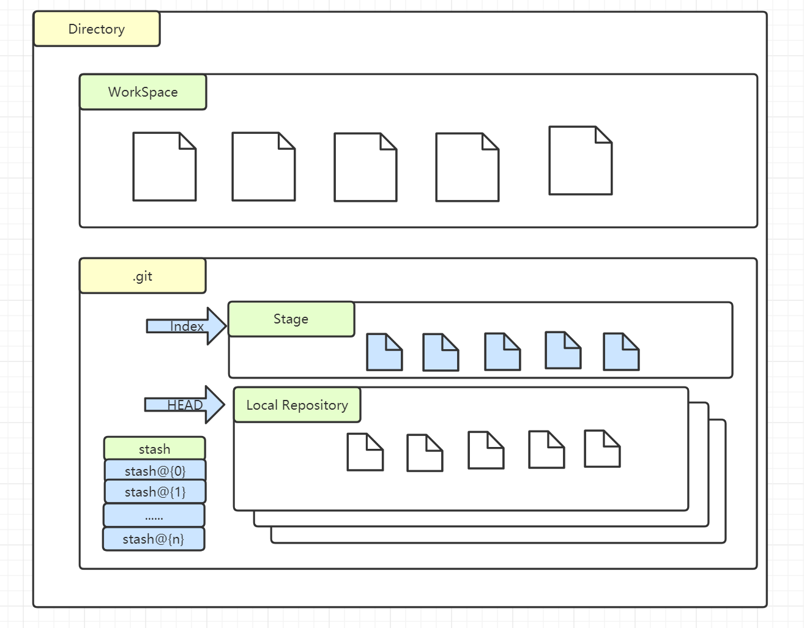

# example of common git commands

This document based repo is a collection of git commands commonly used in daily work.

Github page url: [https://binlecode.github.io/example-git-commands/](https://binlecode.github.io/example-git-commands/)

## Table of contents

[Simple git configuration](./src/git-config.md)

[Simple git rename branch](./src/git-rename-branch.md)

[Simple git stash between branches](./src/git-stash-between-branch.md)

[Simple git reset](./src/git-reset.md)

[Simple git commit amend](./src/git-commit-amend.md)

[Simple git merge and cherry pick](./src/git-merge.md)

[Simple git rebase](./src/git-rebase.md)

[Simple git sync forked repo to upstream](./src/git-sync-forked.md)

[Simple git delete file recovery](./src/git-recover-deleted.md)

[Simple git slides example using MARP](src/git-slides-with-marp.md)

[Simple git search](src/git-search.md)

## Basic git workspace in a nutshell

In the figure above, `Directory` means the project repository folder, under it:
`.git/index` stores staged, but not commited, changes
`.git/HEAD` stores local head commit

### Git states
Git has three internal state management mechanism's, The commit tree HEAD, The staging index, and the working directory.

#### The HEAD
HEAD is the pointer to the current branch reference, which is in turn a pointer to the last commit made on that branch. That means HEAD will be the parent of the next commit that is created. It’s generally simplest to think of HEAD as the snapshot of your last commit on that branch.

#### The Index
The Index is your proposed next commit. This is commonly viewed as Git’s “Staging Area” as this is what's included in next commit.
